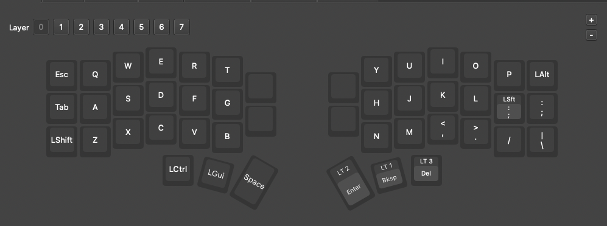
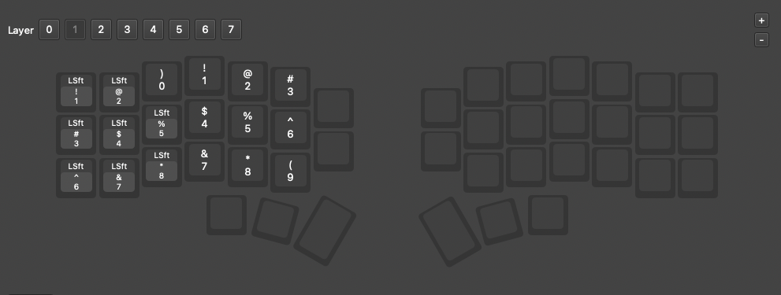
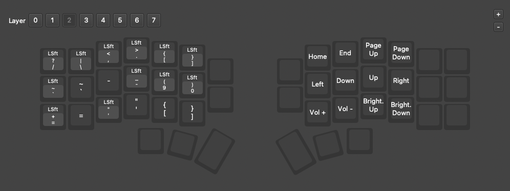
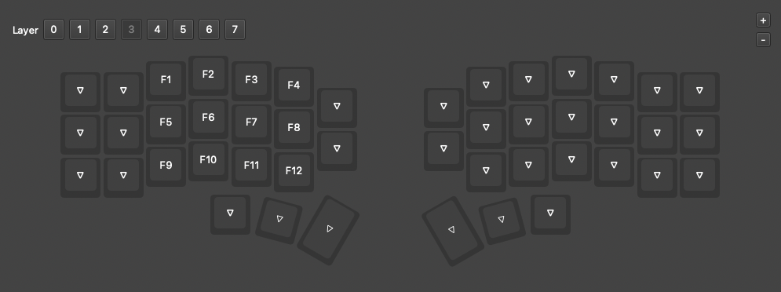

# Key Layout Corne

Contained in this repo is the key layout for a corne split keyboard and associated images per layer. This setup uses 3 modifier keys to access layers.

## Layer 0

## Layer 1

## Layer 2

## Layer 3

